# Talos

**A research platform for cross-domain network intrusion detection.**

Talos exists to answer one question: _does training a model on domain diverse network flows increase and reinforce cross-domain generalisation given consistent features format across datasets?_

**Premise**
A gradient-boosted tree fitted to CIC-IDS 2018 will report near-perfect precision and recall on a held-out split of CIC-IDS 2018, and that number says almost nothing about what happens when the same model is pointed at a different network environment. Talos is built to measure and reinforce a NIDS detection engine for cross-domain network flow classification.

> **Status:** [Here](#status)

---

## Table of contents

- [The problem](#the-problem)
- [The detection ladder](#the-detection-ladder)
- [Status](#status)
- [Architecture](#architecture)
- [The data lake](#the-data-lake)
- [Data sources and dataset roles](#data-sources-and-dataset-roles)
- [The EDA contract](#the-eda-contract)
- [Labelling: the hard problem](#labelling-the-hard-problem)
- [Feature schema](#feature-schema)
- [ML pipeline](#ml-pipeline)
- [Evaluation protocol](#evaluation-protocol)
- [Repository layout](#repository-layout)
- [Usage](#usage)
- [Prior results](#prior-results)
- [Related repositories](#related-repositories)
- [References](#references)
- [License](#license)

---

## The problem

Network traffic is domain-unique. Host counts, topology, service mix, background noise, capture position and clock behaviour all differ between environments. A supervised model trained on one capture will happily learn those domain fingerprints instead of attack behaviour — because in that dataset they are perfectly correlated with the label.

Two results from the predecessor work (IPS-XGBoost) motivated this repository:

1. A model trained on CIC-IDS 2018 **collapsed entirely** when evaluated against traffic captured from a Docker/netem local emulator — despite both sides being extracted with CICFlowMeter into a matching schema with matching encoding. Identical features, identical pipeline, unusable transfer.
2. A model trained on CIC-IDS 2017 **and** 2018 together held ROC 0.78–0.89 against unseen CIC-DDoS 2019. Degraded, but not collapsed.

The difference between those two outcomes is what this project sets out to test: **that domain diversity during the training phase reinforces domain-shift resilience at inference time.** Talos is built to measure how much, under what conditions, and with what features.

There is no free lunch here. A model that survives domain shift is not a model that can classify any network flow after training alone (pre-training and fine tuning is required for deployment success). It is a model that is able to learn the underlying attack behaviours and classify network flows where the features are extracted consistently (same methods and tools) across training datasets and mean the same thing in every network.

## The detection ladder

A useful NIDS has to clear four levels, in increasing order of difficulty.

| Levels | Attack    | Environment | Approach                                                                     |
| ------ | --------- | ----------- | ---------------------------------------------------------------------------- |
| 1      | Known     | Known       | Supervised tree model, in-domain. Solved - provides a baseline.              |
| 2      | Known     | **Novel**   | Multi-domain training + domain-invariant feature selection. **We are here.** |
| 3      | **Novel** | Known       | Layer-2 anomaly model over flows + layer-1 probabilities.                    |
| 4      | **Novel** | **Novel**   | The real golden goal. Lower levels need to work first.                       |

Levels 1 and 2 will use XGBoost. Levels 3 and 4 belong to a second-layer NN that consumes both the raw flow features **and** the layer-1 classifier's output probabilities, so it can reason about _"layer 1 reports a benign flow but nothing in this network has ever looked like this..."_

Layer 2 is designed, not built. It is gated behind a defensible level-2 result.

## Status

| Stage                                            | State                    | Notes                                                    |
| ------------------------------------------------ | ------------------------ | -------------------------------------------------------- |
| Raw pcap ingestion → S3                          | ✅ Working                | 3 public datasets archived immutably                     |
| Zeek extraction (batch, resumable)               | ✅ Working                | `src/data/zeek_batch.sh`, Dockerised Zeek 8.2.1          |
| Zeek logs → Parquet (1:1 tree mirror)            | ✅ Working                | `src/data/to_parquet.py`, streaming, memory-safe         |
| Lake schema discovery / drift check              | ✅ Working                | `src/preprocess/lake_feature_discovery.py`, footers only |
| Statistical profiling + cross-dataset comparison | ✅ Working                | `src/eda/`, reports committed; reads the labelled zone   |
| **Ground-truth labelling**                       | ❌ **Removed 2026-08-04** | v1 was not trustworthy; being rebuilt (see below)        |
| Canonical `mapped` zone                          | ⬜ Not started            | Blocked on labelling                                     |
| Feature registry / schema lock                   | ⬜ Designed only          | Methodology settled, no code                             |
| Training + cross-domain evaluation               | ⬜ Not started            | Blocked on canonical zone                                |
| Layer-2 anomaly model                            | ⬜ Designed only          | Gated behind level 2                                     |
| Detection engine / deployment                    | ⬜ Not started            | —                                                        |

## Architecture

Five subsystems, left to right, with a feedback loop from deployment back into data engineering and three cross-cutting services alongside.

```mermaid
%%{init: {'flowchart': {'nodeSpacing': 20, 'rankSpacing': 80, 'padding': 4, 'subGraphTitleMargin': {'top': 0, 'bottom': 0}}, 'themeVariables': {'fontSize': '12px'}}}%%
flowchart LR
  subgraph DS["Data Sources"]
    A1[Public IDS datasets]
    A2[Network emulator captures]
    A3[Honeypot captures]
  end

  subgraph DE["Data Engineering"]
    B1[Ingestion] --> B2[Zeek extraction]
    B2 --> B3[Schema discovery]
    B3 --> B4[Labelling]
    B4 --> B5[Profiling &<br/>validation]
    B5 --> B6[Feature registry<br/>& mappings]
  end

  subgraph ML["ML Pipeline"]
    C1[Multi-domain<br/>dataset construction] --> C2[Training]
    C2 --> C3[Cross-domain evaluation]
    C3 --> C4[Explainability<br/>& feature analysis]
    C4 --> C5[Model registry]
  end

  subgraph DET["Detection Engine"]
    D1[Flow classification<br/><i>layer 1</i>] --> D3[Decision fusion]
    D2[Unknown behaviour<br/><i>layer 2</i>] --> D3
    D3 --> D4[Alerting]
  end

  subgraph DEP["Deployment & Continual Learning"]
    E1[Live monitoring] --> E2[Analyst feedback]
    E2 --> E3[Domain-specific collection]
    E3 --> E4[Retraining]
  end

  A1 --> B1
  A2 --> B1
  A3 --> B1
  B6 --> C1
  C5 --> D1
  C5 --> D2
  D4 --> E1
  E3 -. domain captures + feedback .-> B1

  X["Cross-cutting: configuration + <br/>experiment tracking + reporting"]
  X -.-> B1
  X -.-> C1
  X -.-> D1
```



Schema discovery runs on the parquet zone before labels exist; statistical profiling runs after labelling, because every statistic it produces is grouped by label class.

Source XML diagrams live in [`docs/diagrams/`](docs/diagrams)

Note: **every stage reads zone _n_ and writes zone _n+1_, and never mutates its input.** Raw pcap archives are immutable. That is what makes a provenance achievable.

## The data lake

Amazon S3, five zones. Configured centrally in [`config.yml`](config.yml).

| Zone        | Prefix            | Contents                                                |
| ----------- | ----------------- | ------------------------------------------------------- |
| ① Raw       | `{dataset}/pcaps` | Original pcap archives, immutable                       |
| ② Extracted | `extracted/`      | Zeek NDJSON logs, per dataset, dated tree preserved     |
| ③ Parquet   | `parquets/`       | One parquet per source `.log`, same tree, no flattening |
| ④ Labelled  | `labelled/`       | conn flows + ground truth — _cleared 2026-08-04, being rebuilt_ |
| ⑤ Canonical | `mapped/`         | Registry-governed, train-ready                          |

## Data sources and dataset roles

Every dataset carries a **role** in `config.yml`, and the role is enforced, not advisory.

| Dataset       | Role      | conn flows | Classes present                                                                        |
| ------------- | --------- | ---------: | -------------------------------------------------------------------------------------- |
| CIC-IDS 2017  | `train`   |  2,119,182 | benign, portscan, dos, ddos, brute_force, web_attack, botnet, infiltration, heartbleed |
| CIC-IDS 2018  | `train`   | 62,341,777 | benign, dos, ddos, brute_force, botnet, web_attack, infiltration                       |
| CIC-DDoS 2019 | `holdout` | 72,533,839 | ddos, benign                                                                           |

2019's benign class is roughly 98% unlabelled attack traffic — only about 110k flows are genuinely benign — which is why false-positive rate is only ever measured on 2017/2018.

### Planned sources

- **Network Emulator** - hosted on an EC2, similar to the CIC-IDS 2018 approach. Planned build post success on existing datasets.
- **Honeypot** - live internet-facing capture. Real adversary behaviour, no synthetic scheduling artefacts, but labelling is a genuinely open problem.

## The EDA contract

The EDA process creates profiles for each dataset that record stats like feature expressions, transforms, and fixed histogram bin edges and more.
`compare.py` **refuses to compare profiles measured on a different ruler** — it checks the per-feature transform, bin edges and expression that each profile carries, and names the offending feature. It deliberately does not gate on the spec file's hash, because a hash also moves when a comment changes and would force a needless re-scan.

The profiler stores a **vast array of statistics:** counts, sums, sums of squares, pairwise sums of products, and fixed-grid histograms, all grouped by `label_class`. Because those are additive, `compare.py` reconstructs the exact pooled mean, variance and correlation matrix of _every other dataset in the pool_ from the JSON alone. The practical consequence is that **adding a fourth dataset costs one scan, not four.** Regenerating every comparison report is fast.

Current spec: **v2**, `sha a6832d31d1c2`, 16 numeric and 10 categorical features over the conn zone (plus `label_binary`, carried as a numeric only so the correlation matrix includes the point-biserial label row).

## Labelling: the hard problem

The v1 labelling stage was built, ran to completion, and was **deleted**. It worked in the sense that it produced labels — it did not work in the sense that those labels were not reliable, and the cause was largely upstream.

### Why timing injection is not enough

The naive approach — mark every flow whose timestamp falls inside a published attack window — fails because benign background traffic keeps flowing during the attack. Correct application needs source IP, destination IP, port, protocol _and_ time window, and the released dataset manifests have documented errors, omissions and incompleteness. The label noise is not random but instead structured and correlated with exactly the traffic we are interested in.

### Three claims this project takes as given

1. No automated method reliably labels flows without human audit.
2. No labelling method transfers unchanged across networks — the transfer failure is domain shift, not labelling error.
3. Accurate labels are achievable _in principle_, at the cost of manual, non-scalable expert correction. It has been done on CIC. It does not scale to a honeypot.

### The new direction: behavioural pseudo-labelling with noise modelling

Rather than trying to make rules that are more precise or broad, the rebuilt module labels flows by **behaviour** and then **models the resulting label noise explicitly** instead of trusting it. The method is adapted from Eslami & Hamouda, _Network Traffic Classification Using Self-Supervised Learning and Confident Learning_ ([arXiv:2509.23522](https://arxiv.org/abs/2509.23522)). Note that the paper's own task is application classification (YouTube, Skype, Google Docs) under a closed-world assumption, so porting it to attack/benign labelling is an adaptation, not a reimplementation.

**Inputs.** After extraction and selection, two pools:

- `D_s` — small, labelled and audited. Used for fine-tuning and model selection. (The paper curates this with DPI, heuristics and manual checks, Talos has no payload, so it has to come from manual audit or verified manifests.)
- `D_l` — large, unlabelled. The thing to be labelled with the final labelling classifier.

**Stage 1 — SSL pretraining on `D_l`.** Two complementary branches:

- **Autoencoder** with constraint-consistent reconstruction. MSE on continuous features, cross-entropy on categoricals, plus a residual penalty enforcing relations that hold in real flows (`rate = bytes / duration`, `length = payload + header`). Reconstructing physically plausible tuples stabilises the latent space.
- **TabCL** — tabular contrastive learning. Two-view NT-Xent with class-conditioned feature replacement, a constraint-preserving projection so augmented views remain valid flows, and dual projection heads with separate configurations for continuous vs categorical slices. Its class-conditioned replacement is bootstrapped from a light classifier trained on `D_s` and refreshed during pretraining, so `D_s` is a dependency of this stage too — not just of stage 2.

**Stage 2 — fine-tune and pseudo-label.** Replace decoder/projection head with a classifier, freeze–unfreeze fine-tune on `D_s`, apply to all of `D_l`. Fuse the two branches by confidence, then margin.

**Stage 3 — traffic-adapted confident learning.** Estimate label noise on the pseudo-labelled pool from _k_-fold out-of-sample probabilities; build the confident joint; assign per-sample weights via per-class quantile thresholds with MAD-based scaling and calibration-aware logistic smoothing; apply a balanced retention constraint so minority classes are preserved in proportion to their estimated clean fraction. Nothing is discarded — uncertain samples are down-weighted.

**Stage 4 — final classifier** trained on the full pseudo-labelled pool with weighted symmetric cross-entropy.

**How this gets judged.** The paper's own headline is in-domain accuracy. That is _not_ the success criterion here, but another question we can attempt to answer is if behavioural pseudo-labels support **better cross-domain generalisation** than manifest-derived labels do. The benchmark is a three-way comparison against timing-injection labels and against the published manifests, scored on level-2 transfer, not on in-domain fit.

## Feature schema

After extracting the full set of possible features with Zeek, we then begin pre-processing. The selection procedure is deliberately re-runnable per deployment, since a procedure fixed once cannot adapt to future network deployments — but its output is a locked schema pinned to a model version.

**Pre-training pruning.** Drop zero-variance features and features with high missingness after imputation. Cluster Pearson/Spearman-correlated features above 0.9 and keep one representative per cluster, with a VIF pass to catch multi-feature collinearity the pairwise matrix misses. Score task relevance by mutual information against the label.

**The domain probe.** Train a logistic classifier to predict _which dataset a flow came from_ using each feature. High domain AUC (>0.75) means the feature encodes provenance, not behaviour.

|Domain AUC|Task relevance|Decision|
|---|---|---|
|Low|High|Keep|
|High|Low|Drop|
|High|High|Hold until post-training — keep or prune on the model's measured evaluation performance|

**Post-training.** Under leave-one-domain-out, check SHAP dependence direction across folds. If there is a consistent sign then keep the feature, a sign that flips should be dropped. Then domain-grouped RFECV (or Boruta) inside each LODO fold, taking the **intersection** of the selected sets - a feature useful in only one fold is not stable enough to ship.

Final schema locks to YAML with every rejection logged.

## ML pipeline

```
map → merge → clean → encode → split → train → register → evaluate
```

Layer 1 is XGBoost over the canonical flow schema. Tree models handle unnormalised, heavy-tailed, mixed-type flow data natively, and sentinel values like `-1` are learned as flags rather than magnitudes — no normalisation stage required. (These sentinels are ours: `spec.yaml` coalesces a missing `id.resp_p` to `-1`. Zeek omits absent fields rather than emitting `-1`.)

Layer 2 is a neural anomaly model taking the flow vector concatenated with layer-1 output probabilities.

Models are written to an S3-backed registry with the schema version, spec hash, training pool composition and evaluation results attached.

## Evaluation protocol

_Design; not yet implemented._

- **Leave-one-domain-out** as the primary protocol. In-domain held-out scores are reported as a sanity check.
- **TPR at a fixed operational FPR** rather than F1 or accuracy. A NIDS at 10⁵ flows/second requires reporting a low false-positive volume, which F1 can hide.
- **FPR measured on 2017/2018 only** — the domains with verified-clean benign classes.
- **Per-attack-family breakdown.** A macro average across families papers over exactly the failures worth reading.

## Repository layout

```
.
├── Makefile
├── config.yml                    # lake zones, dataset roles, Zeek settings
├── requirements.txt
├── src/
│   ├── common/lake.py
│   ├── data/
│   │   ├── zeek_batch.sh
│   │   └── to_parquet.py         # Zeek → Parquet, 1:1 tree mirror
│   ├── preprocess/
│   │   └── lake_feature_discovery.py
│   ├── eda/
│   │   ├── spec.yaml             # features, transforms, bin edges histograms
│   │   ├── spec.py
│   │   ├── profile_dataset.py
│   │   ├── compare.py            # one-against-all
│   │   └── render.py             # JSON → HTML
│   ├── model/
│   ├── evaluate/
│   └── visualization/
├── docs/diagrams/                # architecture source diagrams
├── reports/
│   ├── eda/                      # committed profiles + comparisons (HTML + JSON)
│   └── lake_features_report.txt
├── data/{raw,interim,processed}/ # local scratch (data/raw/ is gitignored)
├── notebooks/
└── models/ results/
```

## Usage

```bash
python -m venv .venv && . .venv/bin/activate
pip install -r requirements.txt
make help                          # list every target
```

Anything that touches the lake needs AWS credentials in the shell first:

```bash
eval "$(aws configure export-credentials --format env)"
```

| Command | What it does |
| --- | --- |
| `make extract` | Zeek over the raw pcaps (run on EC2; `RAW_ONLY=…` to scope) |
| `make convert DATASET=cic-ids-2017` | Mirror one dataset's Zeek logs to Parquet |
| `make discover` | Profile the lake by log type → `reports/lake_features_report.txt` |
| `make eda-smoke` | 200k-row dry run of every dataset — proves the pipeline in seconds |
| `make eda DATASET=cic-ids-2017` | Profile one dataset, then regenerate every comparison |
| `make eda-all` | Profile every dataset, rebuild all reports once at the end |
| `make eda-compare` | Rebuild comparisons from existing profiles (no lake access) |
| `make eda-render` | Rebuild the HTML from existing JSON |

The `eda` targets read the `labelled` zone and will not run until labelling is rebuilt. `make discover` reads `parquets` and works today.

The DuckDB guard rails in the Makefile (spill directory, thread and memory caps) are sized for a 16 GB box and are deliberate — check `nproc` and `free -g` and override rather than assuming.

## Prior results

_From the predecessor repository [`IPS-xgboost`](https://github.com/Awais2805/IPS-xgboost), not from this codebase. Included because they are why Talos exists._

|Experiment|Result|Reading|
|---|---|---|
|Trained 2017+2018 → held-out splits|ROC 0.97–0.99|In-domain ceiling. Establishes the pipeline, not the capability.|
|Trained CIC-IDS 2018 → netemDocker capture|**Complete collapse**|Matching schema and extractor are not sufficient for transfer.|
|Trained 2017+2018 → unseen CIC-DDoS 2019|ROC 0.78–0.89|**No collapse.** Degraded but usable — the result Talos scales up.|

The consistent failure mode across all of these: on genuinely unfamiliar traffic the output probabilities collapse toward zero. The model does not say _"I don't know"_ — it says _"benign"_ confidently. That is the specific behaviour layer 2 exists to catch.

## Related repositories

|Repo|Relationship|
|---|---|
| [`IPS-xgboost`](https://github.com/Awais2805/IPS-xgboost) |Predecessor. Established the baseline pipeline and produced the cross-evaluation results above.|
| [`netemDocker`](https://github.com/Awais2805/netemDocker) |Containerised attacker/victim/capture testbed. Becomes a Talos data source.|

## References

**Datasets**

- Sharafaldin et al., _Toward Generating a New Intrusion Detection Dataset and Intrusion Traffic Characterization_ (CIC-IDS 2017), ICISSP 2018.
- CSE-CIC-IDS 2018, Canadian Institute for Cybersecurity.
- Sharafaldin et al., _Developing Realistic Distributed Denial of Service (DDoS) Attack Dataset and Taxonomy_ (CIC-DDoS 2019), ICCST 2019.

**Method**

- Eslami & Hamouda, _Network Traffic Classification Using Self-Supervised Learning and Confident Learning_, [arXiv:2509.23522](https://arxiv.org/abs/2509.23522), 2025.
- Northcutt, Jiang & Chuang, _Confident Learning: Estimating Uncertainty in Dataset Labels_, JAIR 70, 2021.
- Cui et al., _Tabular Data Contrastive Learning via Class-Conditioned and Feature-Correlation Based Augmentation_, [arXiv:2404.17489](https://arxiv.org/abs/2404.17489), 2024.
- Guerra, Catania & Veas, _Datasets are not enough: Challenges in labeling network traffic_, Computers & Security 120, 2022.
- Engelen, Rimmer & Joosen, _Troubleshooting an Intrusion Detection Dataset: The CICIDS2017 Case Study_, IEEE SPW 2021.
- Rodríguez, Alesanco, Mehavilla & García, _Evaluation of Machine Learning Techniques for Traffic Flow-Based Intrusion Detection_, Sensors 22(23), 9326, 2022.
- Krupski, Iwanowski & Graniszewski, _On the right choice of data from popular datasets for Internet traffic classification_, Computer Communications 233, 2025.

**Tooling**

- [Zeek](https://zeek.org/) — network security monitor, feature extraction.
- [DuckDB](https://duckdb.org/) — in-process analytics over S3 parquet.

## License

Not yet licensed. Until a `LICENSE` file is added, default copyright applies and no reuse rights are granted.
