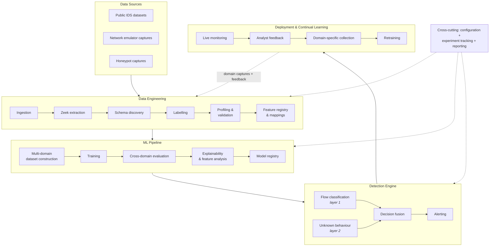

# Talos
**A research project for cross-domain network intrusion detection.**

Talos exists to answer one question: _does training a model on domain diverse network flows increase and reinforce cross-domain generalisation given consistent features format across datasets?_

**Premise**
A gradient-boosted tree fitted to CIC-IDS 2018 will report near-perfect precision and recall on a held-out split of CIC-IDS 2018, and that number says almost nothing about what happens when the same model is pointed at a different network environment. Talos is built to measure and reinforce a NIDS's detection engine for cross-domain network flow classification.

> **Status:** [here](#status)

## Table of contents
- [The problem](#the-problem)
- [The detection ladder](#the-detection-ladder)
- [Status](#status)
- [Architecture](#architecture)
- [The data lake](#the-data-lake)
- [Data sources and dataset roles](#data-sources-and-dataset-roles)
- [The EDA contract](#the-eda-contract)
- [Labelling: the hard problem](#labelling-the-hard-problem)
- [Feature schema](#feature-schema)
- [ML pipeline](#ml-pipeline)
- [Evaluation protocol](#evaluation-protocol)
- [Repository layout](#repository-layout)
- [Usage](#usage)
- [Prior results](#prior-results)
- [Related repositories](#related-repositories)
- [References](#references)
- [License](#license)

## The problem
Network traffic is domain-unique. Host counts, topology, service mix, background noise, capture position and clock behaviour all differ between environments. A supervised model trained on one capture will happily learn those domain fingerprints instead of attack behaviour   because in that dataset they are perfectly correlated with the label.

Two results from the predecessor work (IPS-XGBoost) motivated this repository:
1. A model trained on CIC-IDS 2018 **collapsed entirely** when evaluated against traffic captured from a Docker/netem local emulator   despite both sides being extracted with CICFlowMeter into a matching schema with matching encoding. Identical features, identical pipeline but ultimately resulted in an unusable transfer.
2. A model trained on CIC-IDS 2017 **and** 2018 together held ROC 0.78 0.89 against unseen CIC-DDoS 2019. Degraded, but not collapsed.

The difference between those two outcomes is what this project sets out to test: **that domain diversity during the training phase reinforces domain-shift resilience at inference time.**

Talos is built to measure how much, under what conditions, and with what features. There is no free lunch here. A model that survives domain shift is not a model that can classify any network flow after training alone (pre-training and fine tuning is required for deployment success). It is a model that is able to learn the underlying attack behaviours and classify network flows where the features are extracted consistently (same methods and tools) across training datasets.

## The detection ladder
A useful NIDS has to clear four levels, in increasing order of difficulty.

| Levels | Attack    | Environment | Approach                                                                         |
| ------ | --------- | ----------- | -------------------------------------------------------------------------------- |
| 1      | Known     | Known       | Supervised tree model, in-domain. Solved - provides a baseline.                  |
| 2      | Known     | **Novel**   | Multi-domain training + domain-invariant feature selection. **We are here.**     |
| 3      | **Novel** | Known       | Layer-2 NN anomaly model that inspects flows + passing it layer-1 probabilities. |
| 4      | **Novel** | **Novel**   | The real golden goal. Lower levels need to work first.                           |

Levels 1 and 2 will use XGBoost. Levels 3 and 4 belong to a second-layer NN that consumes both the raw flow features **and** the layer-1 classifier's output probabilities, so it can reason about things such as:_"layer 1 reports a benign flow but nothing in this network has ever looked like this..."_ Layer 2 is designed, not built. It is gated behind a defensible level-2 result.

## Status
| Stage                                            | State           | Notes                                                    |
| ------------------------------------------------ | --------------- | -------------------------------------------------------- |
| Raw pcap ingestion   S3                         |   Working       | `data/ingestion/`, 3 public datasets archived immutably   |
| Zeek extraction (batch, resumable)               |   Working       | `data/extraction/extractors/zeek.py`, Dockerised Zeek 8.2.1 |
| Zeek logs   Parquet (1:1 tree mirror)            |   Working       | `data/conversion/convert.py`, streaming, memory-safe      |
| Lake schema discovery / drift check              |   Working       | `data/discovery/lake_feature_discovery.py`, footers       |
| Statistical profiling + cross-dataset comparison |   Working       | `talos/eda/`; reads the labelled zone, reports regenerated |
| **Labelling module**                             |   In Progress   | Schedule labelling & validation working; behavioural pool partitioning implemented; behavioural models in progress. |
| Canonical `mapped` zone                          |   Not started   | Blocked on labelling                                     |
| Feature registry / schema lock                   |   Designed only | Methodology settled, no code                             |
| Training + cross-domain evaluation               |   Not started   | Blocked on canonical zone                                |
| Layer-2 anomaly model                            |   Designed only | Gated behind level 2                                     |
| Detection engine / deployment                    |   Not started   |                                                          |

## Architecture
Five subsystems, left to right, with a feedback loop from deployment back into data engineering and three cross-cutting services alongside.

<!-- [8] was flowchart LR with node-level cross-subgraph edges, which forced a very wide, short diagram that GitHub shrank to fit. Now TB with `direction LR` per subgraph (swimlanes). Edges are subgraph-to-subgraph on purpose: node-level edges crossing a boundary make mermaid ignore the inner `direction`. -->


Source XML diagrams live in [`docs/diagrams/`](docs/diagrams)

Note: **every stage reads zone *n* and writes zone *n+1*, and never mutates its input.** Raw pcap archives are immutable. That is what makes a provenance achievable.

## The data lake

Five zones, configured centrally in [`config.yml`](config.yml). `lake.root` is the
only thing that decides *where* — a local directory, `s3://…`, `gs://…`, anything
fsspec reaches — and the whole pipeline follows. `talos config` shows how every
zone resolves.

The layout is **source-major**, because sources differ semantically rather than
organisationally: a netem run is labelled by construction, a public dataset has a
published schedule, and a honeypot capture has *no* schedule, so schedule
labelling can never apply to it. Which labelling is applicable belongs in the
path, not in someone's head.

| Zone | Path | Contents |
| --- | --- | --- |
| Raw | `sources/{source}/raw/{dataset}` | Original pcap archives, immutable |
| Extracted | `sources/{source}/extracted/{feature_space}/{dataset}` | Zeek NDJSON logs, dated tree preserved |
| Parquet | `sources/{source}/parquet/{feature_space}/{dataset}` | One parquet per source `.log`, same tree, no flattening |
| Labelled | `sources/{source}/labelled/{feature_space}/{method}/{dataset}` | conn flows + ground truth |
| Canonical | `canonical/{schema_version}/{dataset}` | Registry-governed, train-ready |

`{source}` is one of `datasets` · `netem` · `honeypot`. `{feature_space}` is the
extractor and its version (`zeek_v8.2.1`), and `{method}` is which labelling
method wrote the table — separate paths make accidental pooling of two extractors
or two labellers *impossible* rather than merely discouraged.

**Canonical is deliberately not under a source.** It is exactly where sources stop
being separate: the merged pool the cross-domain experiment draws from. At that
point the source becomes a column, not a directory.

> The live S3 bucket still holds an older flat layout (`parquets/{dataset}`) from
> before this change. `lake.zones` in `config.yml` exists to override the defaults
> for a lake Talos did not create; migrating is a server-side copy, not a
> re-extraction.

## Data sources and dataset roles

Every dataset carries a **role** — but a role is a property of a *study*, not of
the lake. Whether 2019 may contribute to a training pool is a decision the
cross-domain experiment makes; another study could legitimately train on it. So
roles live in [`experiments/{name}/experiment.yaml`](experiments/), hashed into
the experiment's own sha beside the result they produced, while `config.yml`
carries only what is true regardless of experiment (which source the traffic came
from). A dataset an experiment does not mention is `unassigned`, never `train` —
defaulting the other way would let a dataset dropped into the lake join a
training pool because nobody wrote a line about it.

Roles below are those declared by `xdg-v3`, the reference experiment.

| Dataset | Role | conn flows | Classes present |
| --- | --- | --- | --- |
| CIC-IDS 2017 | `train` | 2,119,182 | benign, portscan, dos, ddos, brute_force, web_attack, botnet, infiltration, heartbleed |
| CIC-IDS 2018 | `train` | 62,341,777 | benign, dos, ddos, brute_force, botnet, web_attack, infiltration |
| CIC-DDoS 2019 | `holdout` | 72,533,839 | ddos, benign |

(2019's benign class is roughly 98% unlabelled attack traffic   only about 110k flows are genuinely benign   which is why it is used as a hold-out test set)

### Planned sources

* **Network Emulator** - hosted on an EC2, similar to the CIC-IDS 2018 approach. Planned build post success on existing datasets.
* **Honeypot** - live internet-facing capture. Real adversary behaviour, no synthetic scheduling artefacts,.

## The EDA contract

The EDA process creates profiles for each dataset that record stats like feature expressions, transforms, and fixed histogram bin edges and more.

`compare.py` **refuses to compare profiles measured on a different ruler**   it checks the per-feature transform, bin edges and expression that each profile carries, and names the offending feature. Histograms built on different bin edges are not comparable, so it errors instead of guessing.

The profiler stores a **vast array of statistics:** counts, sums, sums of squares, pairwise sums of products, and fixed-grid histograms, all grouped by `label_class`. Because these are additive, `compare.py` reconstructs the exact pooled mean, variance and correlation matrix of *every other dataset in the pool* from the JSON profile alone. The practical consequence is that **adding another dataset costs one scan, preventing the need to scan all the datasets in the S3 lake.** Regenerating every comparison report is fast.

Current spec: **v2**, `sha a6832d31d1c2`, 16 numeric and 10 categorical features over the conn zone (plus `label_binary`, carried as a numeric only so the correlation matrix includes the point-biserial label row).

## Labelling: the hard problem

The v1 labelling stage was built, ran to completion, and was **deleted**. It worked in the sense that it produced labels   it did not work in the sense that those labels were not reliable, and the cause of the problem was largely upstream and amplified downstream.

### Why timing injection is not enough

The naive approach   mark every flow whose timestamp falls inside a published attack window   fails because benign background traffic keeps flowing during the attack. Correct application needs source IP, destination IP, port, protocol *and* time window, and the released dataset manifests have documented errors, omissions and incompleteness. The label noise is not random but instead structured and correlated with exactly the traffic we are interested in.

### Three claims this project takes as given

1. No automated method reliably labels flows without human audit.
2. No labelling method transfers unchanged across networks   the transfer failure is domain shift, not labelling error.
3. Accurate labels are achievable *in principle*, at the cost of manual, non-scalable expert correction. It has been done on CIC.

### The new direction: behavioural pseudo-labelling with noise modelling

Rather than trying to make rules that are more precise, the rebuilt module labels flows by **behaviour** and then **models the resulting label noise explicitly** instead of trusting it. The method is adapted from Eslami & Hamouda, *Network Traffic Classification Using Self-Supervised Learning and Confident Learning* ([arXiv:2509.23522](https://arxiv.org/abs/2509.23522)). Note that the paper's own task is application classification (YouTube, Skype, Google Docs) under a closed-world assumption, so porting it to attack/benign labelling is an adaptation.

**Inputs.** After extraction and selection, traffic is deterministically and disjointly partitioned (via hash-based bucketing to prevent leakage) into two pools:

* `D_s`   small, labelled and audited. Used for fine-tuning and model selection. (labels must be hand-applied from manual auditing or applied following verified manifest)
* `D_l`   large, unlabelled. The thing to be labelled with the final labelling classifier.

**Stage 1   SSL pretraining on `D_l`.** Two complementary branches:

* **Autoencoder** with constraint-consistent reconstruction. MSE on continuous features, cross-entropy on categorical features, plus a residual penalty enforcing relations that hold in real flows (`rate = bytes / duration`, `length = payload + header`). Reconstructing physically plausible tuples stabilises the latent space.
* **TabCL** (Tabular Contrastive Learning) - Two-view NT-Xent with class-conditioned feature replacement, a constraint-preserving projection so augmented views remain valid flows, and dual projection heads with separate configurations for continuous vs categorical slices. Its class-conditioned replacement is bootstrapped from a light classifier trained on `D_s` and refreshed during pretraining, so `D_s` is a dependency of this stage too   not just of stage 2.

**Stage 2   fine-tune and pseudo-label.** Replace decoder/projection head with a classifier, freeze unfreeze fine-tune on `D_s`, apply to all of `D_l`. Fuse the two branches by confidence, then margin.

**Stage 3   traffic-adapted confident learning.** Estimate label noise on the pseudo-labelled pool from *k*-fold out-of-sample probabilities; build the confident joint; assign per-sample weights via per-class quantile thresholds with MAD-based scaling and calibration-aware logistic smoothing; apply a balanced retention constraint so minority classes are preserved in proportion to their estimated clean fraction. Nothing is discarded   uncertain samples are down-weighted.

**Stage 4   final classifier** trained on the full pseudo-labelled pool with weighted symmetric cross-entropy.

**How this gets judged.** The benchmark is a three-way comparison against timing-injection labels and against the published manifests, scored on level-2 transfer, not on in-domain fit.

## Feature schema

After extracting the full set of possible features with Zeek, we then begin pre-processing.

**Pre-training pruning.** Drop zero-variance features and features with high missingness after imputation. Cluster Pearson/Spearman-correlated features above 0.9 and keep one representative per cluster, with a VIF pass to catch multi-feature collinearity the pairwise matrix misses. Score task relevance by mutual information against the label.

**The domain probe.** Train a logistic classifier to predict *which dataset a flow came from* using each feature. High domain AUC (>0.75) means the feature encodes the domain fingerprints, not attack behaviour.

| Domain AUC | Task relevance | Decision |
| --- | --- | --- |
| Low | High | Keep |
| High | Low | Drop |
| High | High | Hold until post-training   keep or prune on the model's measured evaluation performance |

**Post-training.** Under leave-one-domain-out, check SHAP dependence direction across folds. If there is a consistent sign then keep the feature, a sign that flips should be dropped. Then domain-grouped RFECV (or Boruta) inside each LODO fold, taking the **intersection** of the selected sets (a feature selected in only one fold is not stable enough to keep)

Final schema locks to YAML with every rejection logged.

## ML pipeline

map   merge   clean   encode   split   train   register   evaluate

Layer 1 is XGBoost over the canonical flow schema. Tree models handle unnormalised, heavy-tailed, mixed-type flow data natively, and sentinel values like `-1` are learned as flags rather than magnitudes   no normalisation stage required.

Layer 2 is a neural anomaly model taking the flow vector concatenated with layer-1 output probabilities. Models are written to an S3-backed registry with the schema version, spec hash, training pool composition and evaluation results attached.

## Evaluation protocol

*Design; not yet implemented.*

* **Leave-one-domain-out** as the primary protocol. In-domain held-out scores are reported as a sanity check.
* **TPR at a fixed operational FPR** rather than F1 or accuracy. A NIDS at 10  flows/second requires reporting a low false-positive volume, which F1 can hide.
* **FPR measured on 2017/2018 only**   the domains with verified-clean benign classes.
* **Per-attack-family breakdown.** A macro average across families papers over exactly the failures worth reading.

## Repository layout

```text
├── Makefile                      # thin wrappers over the package
├── pyproject.toml                # package metadata, deps, optional extras
├── config.yml                    # lake zones, dataset roles, Zeek settings
├── requirements.txt              # fallback dependency lock
├── experiments/                  # experiment configs (e.g., xdg-v3) and run histories
├── docs/                         # architecture diagrams and documentation
├── reports/                      # generated reports (e.g., lake_features_report.txt)
├── results/                      # output evaluation artifacts
├── src/talos/                    # core package source
│   ├── cli.py                    # command-line interface front-door
│   ├── points.py                 # central plugin point registrations
│   ├── common/                   # shared configuration, duckdb, and lake IO
│   ├── data/                     # the data engineering pipeline
│   │   ├── conversion/           # extracted Zeek logs -> Parquet/CSV
│   │   ├── discovery/            # lake schema discovery and drift checking
│   │   ├── extraction/           # Zeek/CICFlowMeter extractor plugins
│   │   ├── feature/              # schema lock and feature mapping
│   │   ├── ingestion/            # raw pcap ingestion, immutability, and provenance
│   │   ├── labelling/            # multi-path labelling system
│   │   │   ├── behavioural/      # SSL pseudo-labelling and pool partitioning (D_l/D_s)
│   │   │   ├── oracle/           # independent evidence (Suricata) and offset probes
│   │   │   ├── schedule/         # timing-injection from attack manifests
│   │   │   ├── spaces/           # label space definitions (e.g., core-5)
│   │   │   └── taxonomies/       # raw attack name to canonical class mappings
│   │   └── profiling/eda/        # statistical profiling and cross-dataset comparison
│   ├── engine/                   # detection engine (L1 flow classification, L2 anomaly)
│   ├── experiment/               # experiment loading, parsing, and orchestration
│   ├── model/                    # ML model training, evaluation, and registry
│   └── visualization/            # plotting and charting tools
└── tests/                        # unit tests and snapshot regression (fixtures/golden)
```

## Usage

```bash
make install                       # creates .venv, installs the package
make help                          # list every target
make test                          # golden regression, needs no lake

```

Talos installs as a package (`pip install -e .`). The base install pulls in no cloud SDK; S3 support is the `[s3]` extra and the model libraries are `[model]`. Anything that touches the lake needs AWS credentials in the shell first:

```bash
eval "$(aws configure export-credentials --format env)"

```

| Command | What it does |
| --- | --- |
| `make extract` | Zeek over the raw pcaps (run on EC2; `RAW_ONLY= ` to scope) |
| `make convert DATASET=cic-ids-2017` | Mirror one dataset's Zeek logs to Parquet 1:1 |
| `make label DATASET=cic-ids-2017` | Attach ground truth labels (defaults to `schedule` method) |
| `talos label --dataset cic-ids-2017 --method <name>` | Label flows using the specified method (e.g., `schedule`, `ae-v1`) |
| `make discover` | Profile the lake by log type   `reports/lake_features_report.txt` |
| `make eda-smoke` | 200k-row dry run of every dataset - for testing the pipeline flow |
| `make eda DATASET=cic-ids-2017` | Profile one dataset, then regenerate every comparison |
| `make eda-all` | Profile every dataset, rebuild all reports once at the end |
| `make eda-compare` | Rebuild comparisons from existing profiles (no lake access required) |
| `make eda-render` | Rebuild the HTML from existing JSON |

## Prior results

*From the predecessor repository [`IPS-xgboost`](https://www.google.com/search?q=https://github.com/Awais2805/IPS-xgboost), not from this codebase. Included as it provides background context.*

| Experiment | Result | Notes |
| --- | --- | --- |
| Trained 2017+2018   held-out splits | ROC 0.97 0.99 | In-domain ceiling. Establishes the pipeline, not the capability. |
| Trained CIC-IDS 2018   netemDocker capture | **Complete collapse** | Matching schema and extractor are not sufficient for transfer. |
| Trained 2017+2018   unseen CIC-DDoS 2019 | ROC 0.78 0.89 | **No collapse.** Degraded but usable   the result Talos scales up. |

The consistent failure mode across all of these: on genuinely unfamiliar traffic the output probabilities collapse toward zero. The model does not say its unsure, it just labels flows as *benign* confidently. That is the specific behaviour layer 2 exists to catch.

## Related repositories

| Repo | Relationship |
| --- | --- |
| [`IPS-xgboost`](https://www.google.com/search?q=https://github.com/Awais2805/IPS-xgboost) | Predecessor. Established the baseline pipeline and produced the cross-evaluation results above. |
| [`netemDocker`](https://www.google.com/search?q=https://github.com/Awais2805/netemDocker) | Containerised attacker/victim/capture testbed. Becomes a Talos data source. |

## References

**Datasets**

* Sharafaldin et al., *Toward Generating a New Intrusion Detection Dataset and Intrusion Traffic Characterization* (CIC-IDS 2017), ICISSP 2018.
* CSE-CIC-IDS 2018, Canadian Institute for Cybersecurity.
* Sharafaldin et al., *Developing Realistic Distributed Denial of Service (DDoS) Attack Dataset and Taxonomy* (CIC-DDoS 2019), ICCST 2019.

**Method**

* Eslami & Hamouda, *Network Traffic Classification Using Self-Supervised Learning and Confident Learning*, [arXiv:2509.23522](https://arxiv.org/abs/2509.23522), 2025.
* Northcutt, Jiang & Chuang, *Confident Learning: Estimating Uncertainty in Dataset Labels*, JAIR 70, 2021.
* Cui et al., *Tabular Data Contrastive Learning via Class-Conditioned and Feature-Correlation Based Augmentation*, [arXiv:2404.17489](https://arxiv.org/abs/2404.17489), 2024.
* Guerra, Catania & Veas, *Datasets are not enough: Challenges in labeling network traffic*, Computers & Security 120, 2022.
* Engelen, Rimmer & Joosen, *Troubleshooting an Intrusion Detection Dataset: The CICIDS2017 Case Study*, IEEE SPW 2021.
* Rodr guez, Alesanco, Mehavilla & Garc a, *Evaluation of Machine Learning Techniques for Traffic Flow-Based Intrusion Detection*, Sensors 22(23), 9326, 2022.
* Krupski, Iwanowski & Graniszewski, *On the right choice of data from popular datasets for Internet traffic classification*, Computer Communications 233, 2025.

**Tooling**

* [Zeek](https://zeek.org/)   network security monitor, feature extraction.
* [DuckDB](https://duckdb.org/)   in-process analytics over S3 parquet.

## License

Not yet licensed. Until a `LICENSE` file is added, default copyright applies and no reuse rights are granted.
